# OpenFlight User Guide

A walkthrough of the OpenFlight on-screen apps: the **Interactive** kiosk (7"
touchscreen or TV), the **Scoreboard** display, and the **Web Remote**. It covers
every tab, sub-tab, and setting, plus VoiceOver/screen-reader support and the
supported control methods.

> These screenshots come from the app in mock mode (`scripts/start-kiosk.sh --mock`),
> so the numbers are simulated. The layout and controls match a live session.

---

## Contents

1. [The three screens at a glance](#the-three-screens-at-a-glance)
2. [Starting OpenFlight](#starting-openflight)
3. [Choosing your screen mode](#choosing-your-screen-mode)
4. [Interactive mode (kiosk / TV)](#interactive-mode-kiosk--tv)
   - [Top bar](#top-bar)
   - [Selecting a club](#selecting-a-club)
   - [LIVE tab](#live-tab)
   - [ANALYTICS tab](#analytics-tab)
   - [HISTORY tab](#history-tab)
   - [DEBUG / Diagnostics tab](#debug--diagnostics-tab)
5. [Scoreboard mode](#scoreboard-mode)
6. [How the screens stay in sync](#how-the-screens-stay-in-sync)
7. [Settings](#settings)
8. [Accessibility & VoiceOver](#accessibility--voiceover)
9. [Control methods](#control-methods)
10. [Pairing the mobile app](#pairing-the-mobile-app)
11. [Metric glossary](#metric-glossary)

---

## The three screens at a glance

| Surface | Where it runs | What it's for |
|---|---|---|
| **Interactive** (formerly "TV" mode) | 7" kiosk touchscreen, or scaled up on a TV | Full control - hit shots, pick clubs, browse analytics/history, change settings. Operable by touch **or** remote. |
| **Scoreboard** | A TV or monitor across the room | Passive, glanceable stats you read from a distance. Updates automatically; still operable by remote/touch. |
| **Web Remote** | Any phone/tablet browser on the same network (`/remote`) | A D-pad + OK + Back to drive whichever display is in view, no extra hardware. |

Interactive and Scoreboard are the same app in two **view modes** - you pick one on
first run and can switch anytime in Settings.

---

## Starting OpenFlight

Launch the kiosk from the Raspberry Pi:

```bash
scripts/start-kiosk.sh              # Default: rolling buffer + sound trigger
scripts/start-kiosk.sh --mock       # Development/demo mode, no radar required
scripts/start-kiosk.sh --kld7       # With K-LD7 angle radars (launch angle / aim)
```

The script handles the virtual environment, builds the UI, and opens the display in
full-screen Chromium. The web UI is also reachable from other devices at
`http://<pi-ip>:8080`.

---

## Choosing your screen mode

The first time a larger external screen connects, OpenFlight asks how you're using
it. The Pi auto-detects the screen (EDID/CEC) and pre-highlights the likely option
with a **DETECTED** badge. The small 7" kiosk panel skips this and defaults to
Interactive.

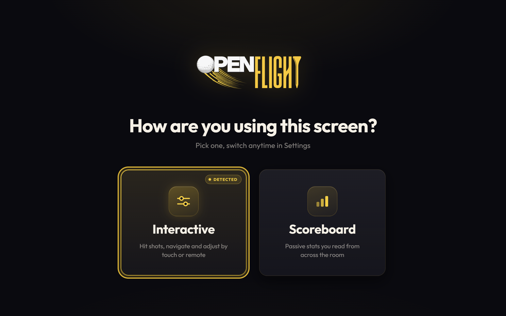

- **Interactive** - "Hit shots, navigate and adjust by touch or remote."
- **Scoreboard** - "Passive stats you read from across the room."

OpenFlight saves your choice per device and applies it live. Change it anytime in
**Settings → View mode** (no reload needed).

---

## Interactive mode (kiosk / TV)

### Top bar

Present on every tab:

- **OpenFlight logo** (left) and a **CONNECTED** indicator showing the server link.
- **CLUB ▾** - the active club; tap to reopen the club picker.
- **⚙ Settings** - opens the settings drawer.
- **⏻ Power** - shutdown (asks for on-screen confirmation first).

The navigation tabs are **LIVE · ANALYTICS · HISTORY · DEBUG**, with an optional
**CAMERA** tab. By default Debug is shown and Camera is hidden - toggle both in
**Settings → Navigation**. (The ANALYTICS label is localized; it reads "Stats" in
several languages.)

### Selecting a club

At the start of a session you choose the club you're hitting. Clubs are grouped into
**Irons, Hybrids, Woods** (and wedges). The selected club is used to estimate carry,
roll, and total distance.

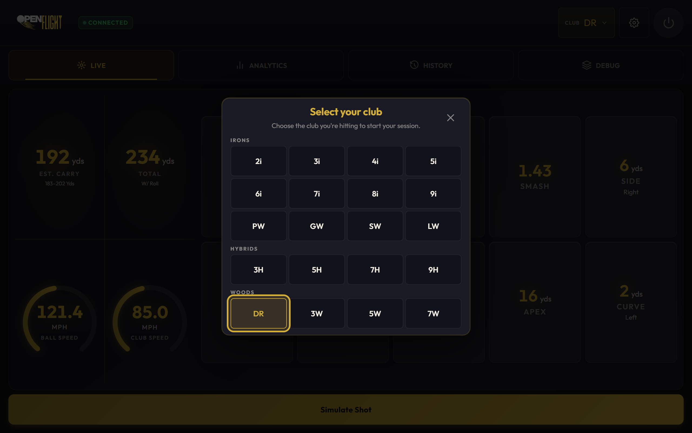

### LIVE tab

The main shot screen. After each shot, the metrics animate in. The large left cards
show **Estimated Carry** and **Total (with roll)**; the gauges show **Ball Speed**
and **Club Speed**; the grid shows launch, path, spin and shape metrics. Each metric
shows a quality cue (e.g. **Low / High / Perfect**) and, for launch/angle metrics,
its data source (**Radar**, **Camera**, or **Estimated** - **Mock** in demo mode).

In mock/demo mode a **Simulate Shot** button appears at the bottom to inject a shot.

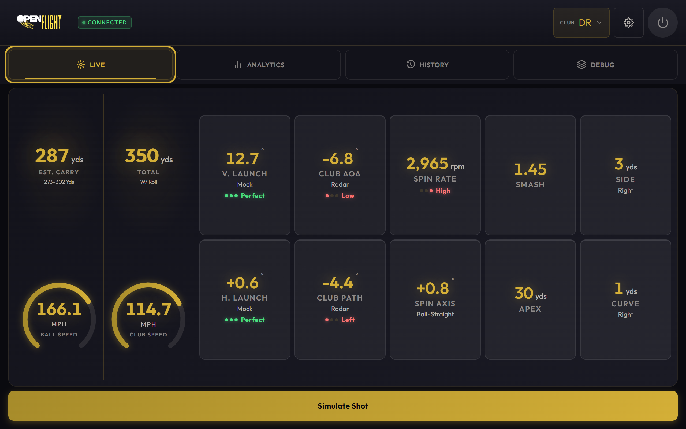

See the [Metric glossary](#metric-glossary) for what each number means.

### ANALYTICS tab

Session aggregates, charts, and coaching. A row of **sub-tabs** - Home, Clubs,
Trends, Coaching, Shots - switches between views.

#### Filters (apply to every sub-tab)

The **Filters** button (top-right) opens a panel that narrows the data set for *all*
sub-tabs at once. The shot count beside it shows how many shots match. Two filter
sections, each a row of chips:

- **Session** - *All Sessions* or one specific past session.
- **Club** - *All* or one specific club in your bag.

A badge on the button shows when a filter is active; **Done** closes the panel.

> Note: the **Trends** sub-tab has its own additional **club-group** pills (below),
> separate from this global Club filter.

#### Home

Headline session averages - **Avg Carry, Avg Ball, Avg Club** - a tile row of
**Avg Smash, Avg Launch, Avg Spin, Consistency (±yds), Shots**, and a chart that
adapts to your data: an **Avg Carry by Club** bar chart when several clubs are
present, or a **carry distribution** histogram for a single club. **Clear Session**
(bottom) wipes the current session.

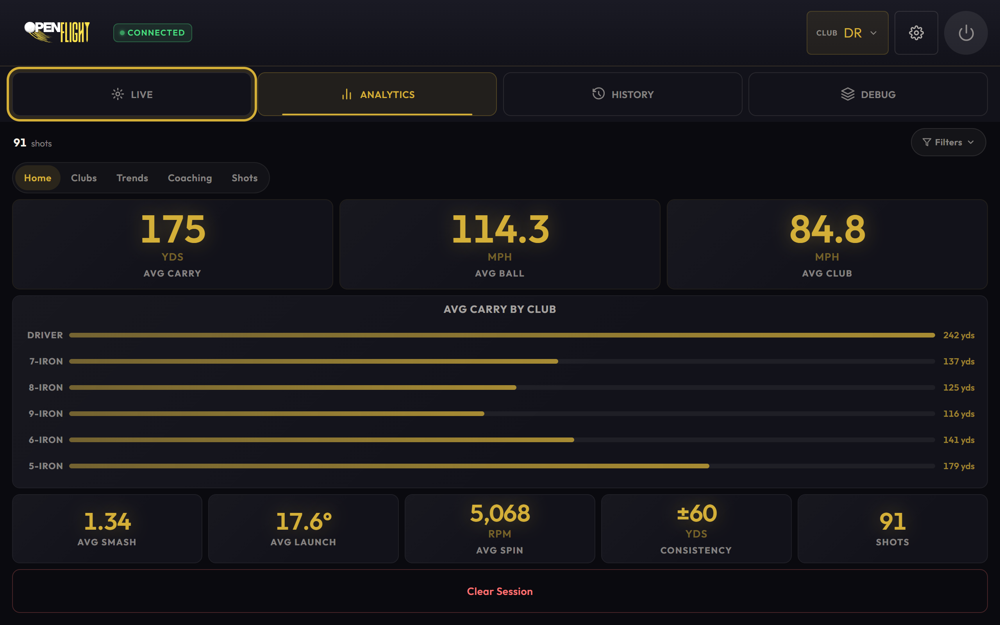

#### Clubs

A **Club Overview** table to compare gapping across your bag - per club: **Median
(yds)**, **Gapping** (yardage step to the next club), **Longest**, and **Hits** -
plus shot-dispersion and ball-trajectory views. Respects the active Club filter.

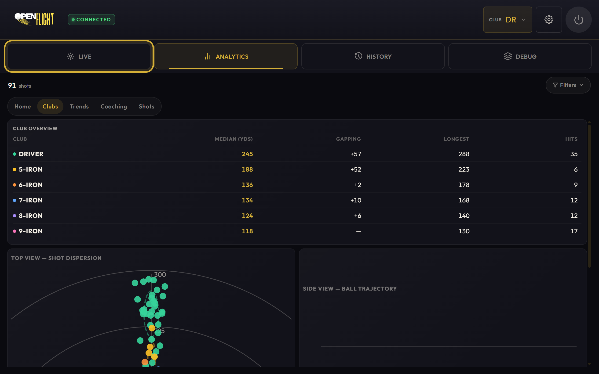

#### Trends

How your numbers move across the session. **Club-group pills** at the top -
**All · Driver · 3W · Hybrid · Irons · Wedge** (only groups present in your data
appear) - scope every chart below.

- **Session stats table** - **Avg** and **Median** rows across Carry, Total, Apex,
  Ball, Club, Smash, Launch, Spin, Dev (dispersion), and Path.
- **Carry spread** box plots per club, **Shot dispersion** box plots, and a
  **carry-distance over time** scatter.

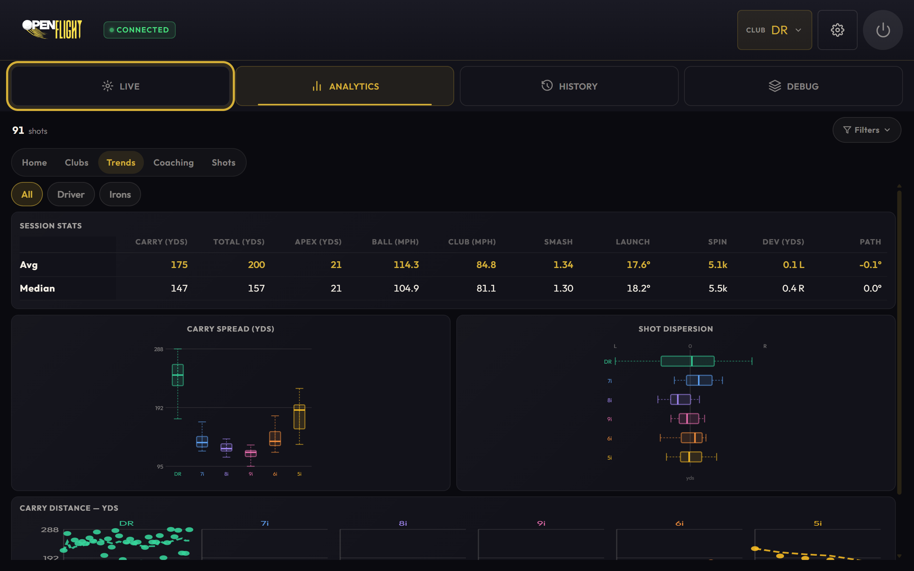

#### Coaching

Turns your shot pattern into prioritized guidance. Four blocks:

1. **Strike Quality** - a 0–100 score (60% smash, 40% consistency) with a label -
   **Elite ≥85 · Solid ≥68 · Developing ≥50 · Opportunity** - plus your smash
   average vs. target, consistency, and the carry yards left on the table.
2. **Insights** - ranked callouts tagged **Priority / Consistency / Launch
   Conditions / Strike Quality / Ball Flight**, each with a headline, an explanation,
   and (where quantifiable) a yardage opportunity. Needs ≥3 shots of the dominant
   club.
3. **Root Cause** chain + a **Fix** (see below).
4. **Practice Drills** - up to three numbered, club-appropriate drills, each with a
   description and a one-line key thought.

Below these, a **Know Your Distances** table gives, per club: **Avg**, a
**Reliable** number (avg − 1σ, ~your "go-to" carry), a **Conservative** number
(avg − 2σ), and shot **count**.

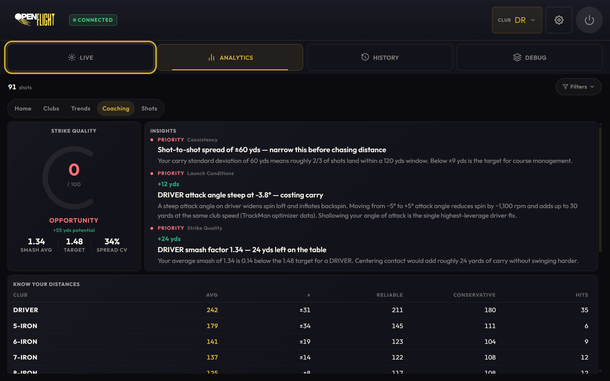

#### Shots

The full per-shot table for the active filter, newest first, 12 per page. Each row is
color-coded by shot quality, and **#** and **Club** are always shown.

The **Columns** button (top-right, with a badge showing how many are active) opens a
picker to choose exactly which metrics appear. Toggle any of **18 columns** across
five groups; **Reset** restores the defaults (★). Every column is defined in the
[Metric glossary](#metric-glossary).

| Group | Columns |
|---|---|
| **Distance** | Est. Carry ★, Total, Roll, Apex, Deviation (offline ±) |
| **Speed** | Ball Speed ★, Club Speed ★, Smash |
| **Launch** | V. Launch ★, H. Launch, Club AoA |
| **Club** | Club Path, Face-to-Path |
| **Spin** | Spin Rate ★, Spin Axis, Backspin, Sidespin, Shot Shape |

> ★ = on by default (Est. Carry, Ball Speed, Club Speed, V. Launch, Spin Rate). The
> same Columns picker drives the **History → session detail** table.

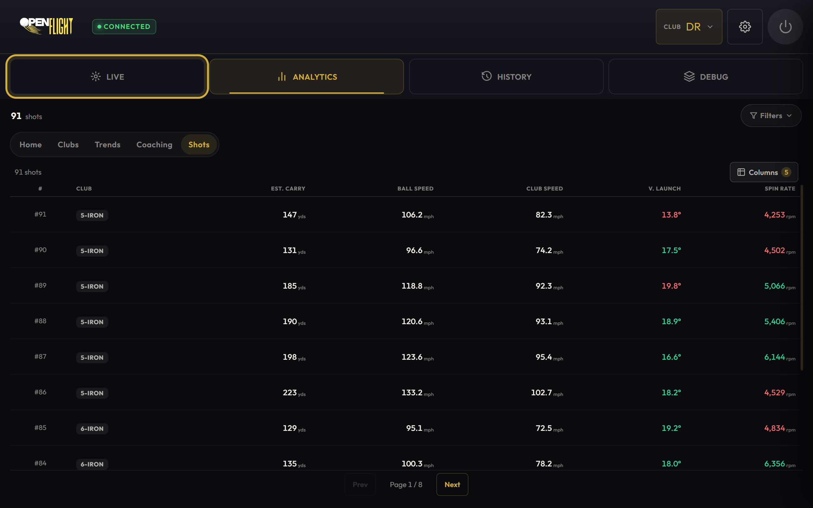

#### How the Root-Cause chain and drills work

Coaching is **rules-based**, not AI guesswork - it compares your averages against
per-club optimal windows derived from TrackMan/PGA Tour benchmarks
([analysis.ts](../ui/src/utils/analysis.ts),
[clubThresholds.ts](../ui/src/utils/clubThresholds.ts)).

1. **Fault detection.** For your dominant club it flags faults only past
   conservative, club-specific thresholds - e.g. driver attack angle below −2°, smash
   ≥0.04 under target, spin >1.2× benchmark, club path >4° off-line, or carry
   variation (CV) above the club's limit. Each club category has its own windows and
   a minimum shot count before anything is flagged.
2. **Chain selection.** The most *upstream* fault wins (a steep attack angle is
   reported before the high spin it causes). The chosen fault maps to a **cause →
   effect chain** - e.g. *Steep attack angle → high spin loft → excess spin →
   distance loss* - with the live numbers filled in.
3. **The Fix.** Each chain ends in a **Fix**: a named drill plus a swing cue. If the
   primary drill doesn't suit your club, a club-appropriate fallback is used.
4. **Drill library.** 14 drills (Shallow-AoA, Low-Face, Impact-Board, Shaft-Lean,
   Tempo, Wall, Step-Through, Lag-Pump, Headcover-Path, Gate, Face-Control,
   Low-Point, Connection, Half-Swing). Faults map to an ordered, club-filtered drill
   list, so wood faults and wedge faults surface different practice work.

Recognised fault chains include steep attack angle, low-face gear effect, casting /
early release, off-center contact, stalled hips / flip, excess spin, out-to-in slice,
face-to-path mismatch, path deviation, and tempo inconsistency.

### HISTORY tab

**Past Sessions** - every recorded session with its date, time, and shot count.
Sessions with shots show a **›** chevron; tap one to open its detail.

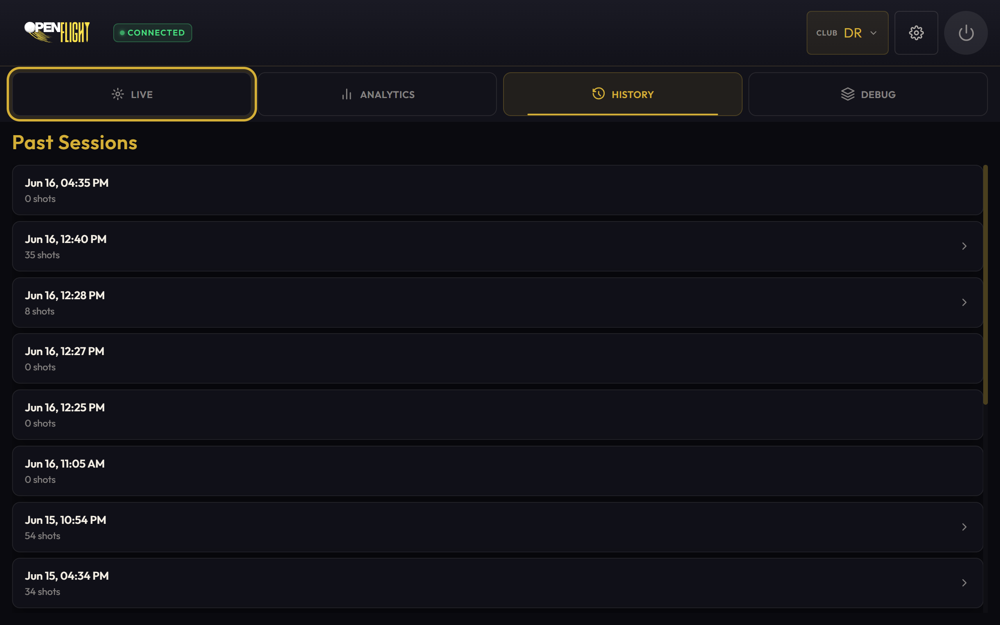

The session detail is the same paginated **per-shot table** used by the Analytics
**Shots** tab - so it has the identical **Columns** picker: add or remove any of the
**18 metrics** across Distance / Speed / Launch / Club / Spin (all defined in the
[Metric glossary](#metric-glossary)), with **Reset** to defaults. **Prev / Next**
page through the shots, 12 per page.

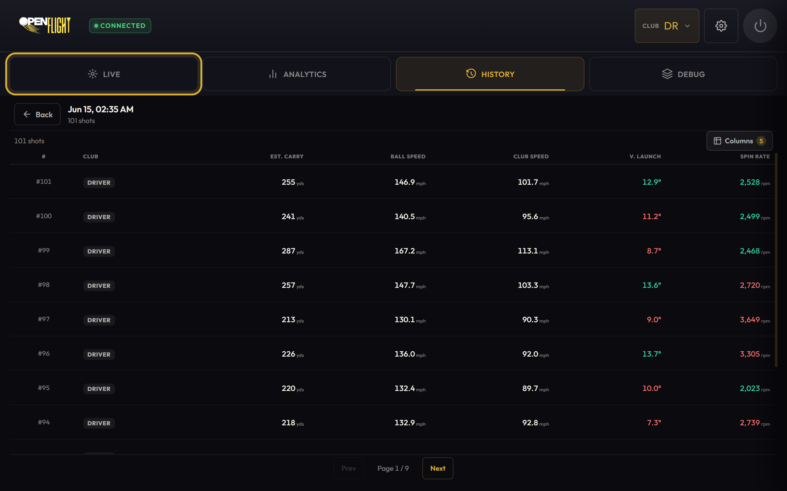

### DEBUG / Diagnostics tab

Hardware and signal diagnostics. Up to three sub-tabs:

**Status** - system mode (e.g. MOCK / rolling-buffer), radar connection state, and
trigger counts. A **Record** toggle (top-right) captures raw data for later
analysis.

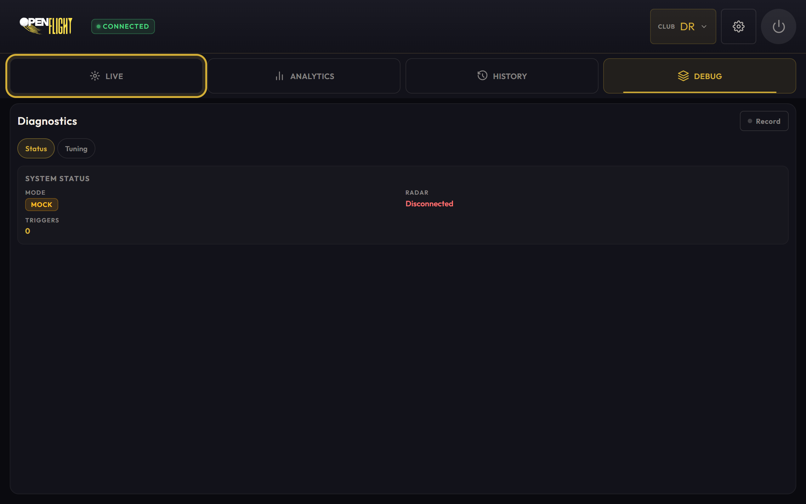

**History** - a recent trigger accept/reject log (shown only in rolling-buffer mode;
hidden in mock mode).

**Tuning** - live signal/trigger tuning for hardware setup.

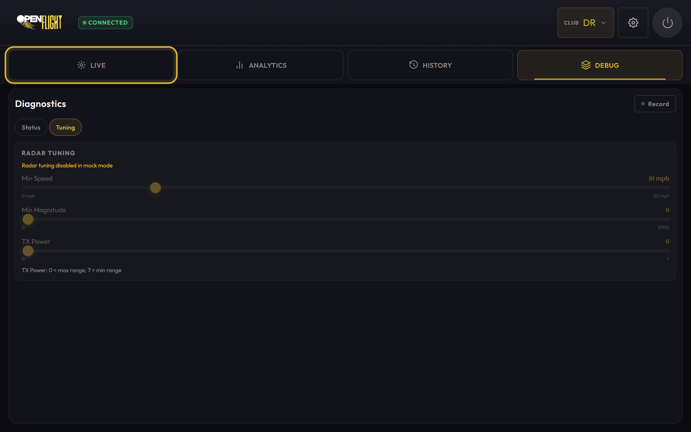

> The Camera and Debug tabs can be shown or hidden in **Settings → Navigation**
> (Debug is on by default, Camera is off).

### CAMERA tab

An optional tab for the ball-tracking camera - **hidden by default**; turn it on with
**Settings → Navigation → Camera Tab**. Once enabled it appears as a fifth nav tab.

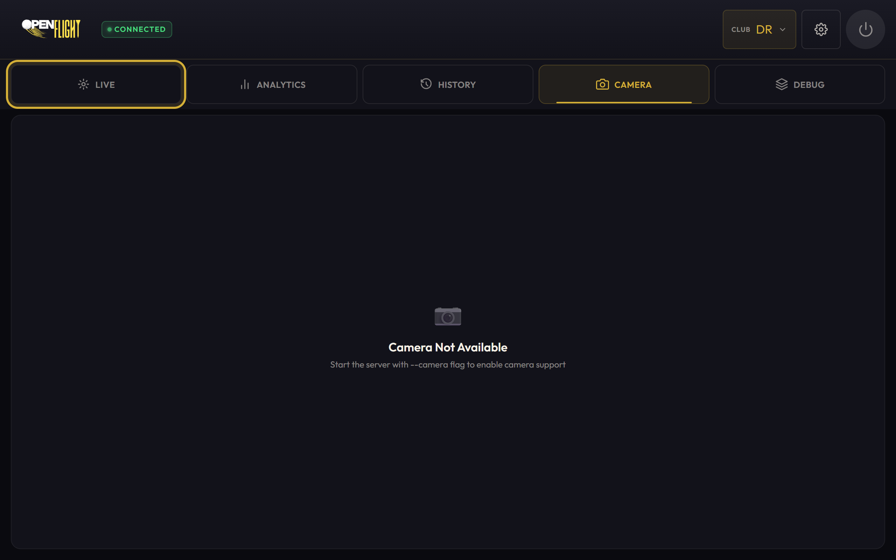

*Above: the Camera tab on a `--mock` server with no camera attached - start the
server with the camera flag (or attach a camera) to get a live feed.* It shows a
**Camera Feed** with two controls:

- **Enable / Disable Camera** - powers the camera on or off.
- **Start / Stop Stream** - begins or pauses the live video (only when enabled).

The tab reflects whatever state the camera is in:

| State | What you see |
|---|---|
| No camera hardware | "Camera not available" |
| Camera off | "Camera disabled" prompt to enable it |
| Enabled, not streaming | "Stream paused" with a **ball-detection** readout (detected + confidence %) |
| Streaming | Live video with a **ball-detected: NN%** overlay |
| Stream error | An error message with a **Retry** button |

When the camera is present and streaming, the Scoreboard's left panel shows the live
feed in place of the trajectory/dispersion visualizer.

---

## Scoreboard mode

A passive, big-type display for watching from across the room. It auto-updates with
every shot and needs no interaction, though a remote or touch still works.

- **Left:** a **Side view** ball-trajectory trace and a **Top view** shot-dispersion
  pattern (built from radar + K-LD7 data; falls back to a clean visualizer when no
  camera is present).
- **Right:** the current club name and a large stat panel - Est. Carry, Total, Ball
  Speed, Club Speed, V/H Launch, Club Path, Club AOA, Spin Rate, Spin Axis.
- **Bottom:** a strip of recent shots, plus socket/camera status indicators.

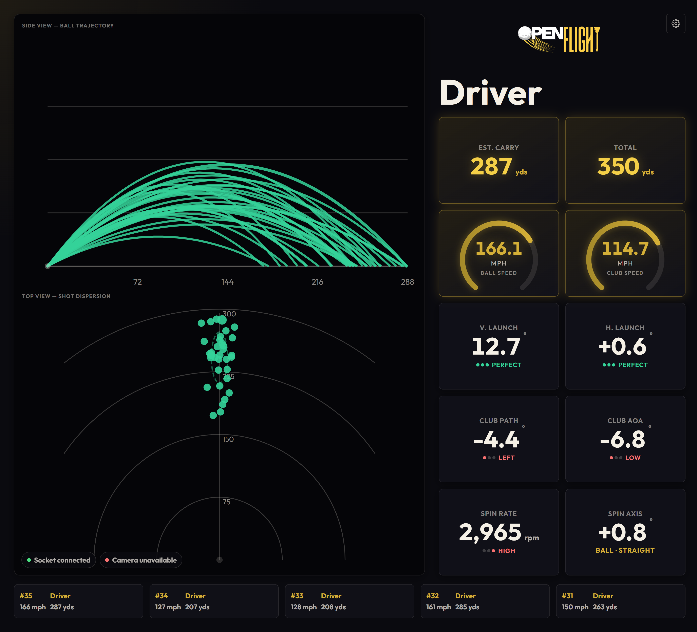

---

## How the screens stay in sync

Every screen - the 7" kiosk, an Interactive TV, and a Scoreboard - is a **thin client
of the one Flask server** on the Pi. The screens never talk to each other directly:
each holds a live **Socket.IO** connection to the server, and the server **broadcasts**
events to all connected screens at once. Run as many displays as you like; they all
mirror the same live session.

```text
              hit a shot
   radar ─► Flask server ──broadcast──► 7" kiosk (Interactive)
                  │         (Socket.IO) ├──► TV (Interactive)
   mobile app ◄───┤                     ├──► Scoreboard
   web remote ────┘                     └──► mobile app
```

### What updates in real time on every screen

| Event | Trigger | Effect on all screens |
|---|---|---|
| `shot` | You hit a shot (or **Simulate Shot**) | The shot appears on every screen instantly |
| `session_state` | A screen connects or refreshes | That screen catches up with the full current session - late joiners aren't left behind |
| `club_changed` | You change the active club | All screens switch club |
| `session_cleared` | **Clear Session** | All screens clear |
| `camera_status` / `debug_toggled` / `radar_config` | Toggled on any screen | Broadcast to all |
| `remote_key` | Web Remote D-pad press | Moves focus on the display |
| `accessibility_prefs_update` | Mobile app pushes prefs | Displays update live |

The shot path runs **radar → server → broadcast `shot` → every screen renders it**.
No screen is the "primary" one. Open a Scoreboard mid-session and the server replays
the full session to it on connect.

### What does *not* sync the same way (important)

Shots are fully shared; **settings are mostly per-device**:

- **Accessibility prefs** (Reduce Motion, High Contrast, Larger Text) sync **from the
  mobile app to all displays** - but a kiosk does **not** push its own Settings
  changes to sibling screens, and **Color Blind Mode** is not part of the synced set.
- **Units, Language, and View Mode** live in **each screen's own browser**
  (`localStorage`). Changing them on one screen does not change another, so you can
  run a Scoreboard in yards while the kiosk shows metres.

**Shots, club, and session state stay shared live across all screens.** Display
preferences stay local to each screen, and only the **mobile app** pushes a subset of
settings out to every display at once.

---

## Settings

Open with the **⚙** icon. The drawer is identical in both view modes (the kiosk adds
a Navigation section). Settings sync from the mobile app when it's connected.

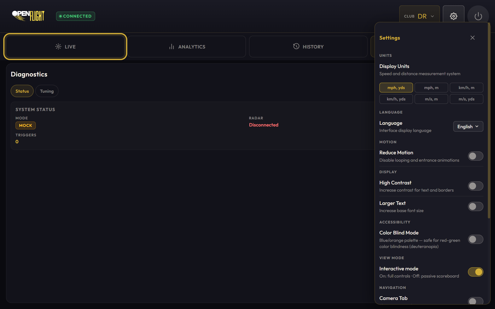

| Section | Control | What it does |
|---|---|---|
| **Units** | Display Units | Pick the speed/distance combo: `mph, yds` · `mph, m` · `km/h, m` · `km/h, yds` · `m/s, m` · `m/s, yds`. |
| **Language** | Language | 16 languages (see below). |
| **Motion** | Reduce Motion | Disable looping and entrance animations. |
| **Display** | High Contrast | Increase contrast for text and borders. |
| **Display** | Larger Text | Increase the base font size. |
| **Accessibility** | Color Blind Mode | Blue/orange palette - safe for red-green color blindness (deuteranopia). |
| **View Mode** | Interactive mode | On: full controls · Off: passive scoreboard. |
| **Navigation** *(kiosk only)* | Camera Tab | Show/hide the camera tab in navigation. |
| **Navigation** *(kiosk only)* | Debug Tab | Show/hide the debug tab in navigation. |
| **Pair Mobile** | QR code | Scan from the OpenFlight mobile app to pair over Wi-Fi/BLE. |

**Languages:** English, Español, Français, Deutsch, Português, Italiano, Nederlands,
Svenska, Norsk, Dansk, Suomi, 日本語, 한국어, ภาษาไทย, 中文简体, 中文繁體.

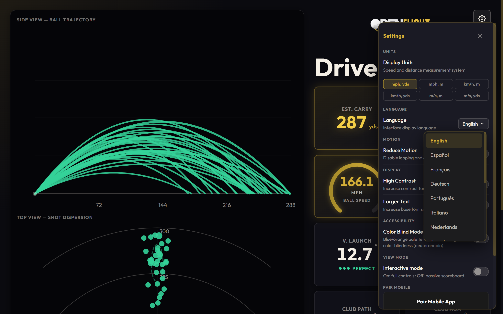

Scroll to the bottom for the **Pair Mobile** QR code:

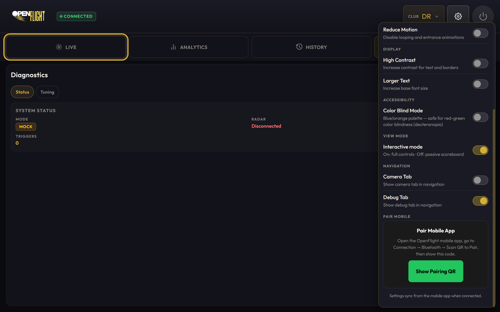

---

## Accessibility & VoiceOver

OpenFlight runs fully without sight or touch.

**Visual adjustments** (Settings): **Reduce Motion**, **High Contrast**, **Larger
Text**, and **Color Blind Mode**. OpenFlight saves each per device and applies it live.

**Screen reader support** (VoiceOver on iOS/macOS/tvOS, TalkBack on Android, NVDA/JAWS
on desktop):

- **One concise announcement per shot** - club + carry + ball speed (e.g.
  *"Driver: Est Carry 245 yards, Ball Speed 167 mph"*), not all ten metrics.
- **Each metric tile is a single stop**, spoken as a phrase - *"V. Launch: 13.4
  degrees, Perfect"*; the `°` is read as "degrees". Placeholders read *"Club Path: no
  data"*.
- **Speed gauges** announce once, e.g. *"Ball Speed, 167.4 mph"*.
- **Charts are decorative** and silent - the data path is the spoken summary, not the
  trajectory/dispersion SVGs.
- **Stable headings** - a persistent "OpenFlight Display" page heading with "Recent
  shots" and club sub-headings, so the heading rotor works.
- **Recent-shot chips** each read as one stop - *"Shot 12: Driver, 167 mph"*.

These behaviors are exercised by the manual test plan in
[docs/test-plans/screen-reader-voiceover.md](test-plans/screen-reader-voiceover.md).

---

## Control methods

The UI accepts three input families, all converging on the same focus engine
(arrow keys + Enter / Esc):

### 1. Touch
Direct on the 7" kiosk panel or any touchscreen TV.

### 2. Keyboard / D-pad (spatial navigation)
On a TV, **Up/Down/Left/Right** move a large focus ring to the nearest control,
**OK/Enter** activates it, and **Back/Esc** closes a dialog. Spatial navigation and
the 10-foot focus ring turn on in TV mode (`?tv=1`, or auto-detected on smart-TV
browsers).

| Remote button | Key | Effect |
|---|---|---|
| D-pad Up/Down/Left/Right | Arrow keys | Move focus |
| OK / Select | Enter | Activate focused control |
| Back / Exit | Esc | Close panel / dialog |

There are several ways to get a remote's presses into the Pi (full setup in
[docs/tv-remote-control.md](tv-remote-control.md)):

| Path | Hardware | Best for |
|---|---|---|
| **HDMI-CEC** | none (uses the HDMI cable) | A TV on **HDMI** using its own remote. |
| **FLIRC USB-IR** | ~$25 USB dongle | **DisplayPort**, or one brand-agnostic remote. |
| **GPIO / USB IR** (`ir-keytable`) | ~$2 IR receiver | Cheap IR alternative to FLIRC. |
| **Bluetooth HID remote / air-mouse** | a BT remote | No line-of-sight; pairs like a keyboard. |
| **Native smart-TV browser** | none | Loading the kiosk in a Samsung/LG/Android TV browser - the TV's remote drives it natively, zero setup. |

**HDMI-CEC** is built into the cable; enable it on the TV under its brand name:

| Brand | CEC setting name |
|---|---|
| Samsung | Anynet+ (HDMI-CEC) |
| LG | SimpLink |
| Sony | Bravia Sync |
| Philips | EasyLink |
| Panasonic | VIERA Link |
| Vizio | CEC |
| TCL / Hisense (Android TV) | CEC / T-Link / HDMI-CEC |

> DisplayPort has no CEC channel - use FLIRC (or another IR/BT path) there.

### 3. Phone/tablet Web Remote
The no-hardware fallback. On any device on the same network, open:

```
http://<pi-ip>:8080/remote
```

You get a D-pad, OK, and Back. Presses relay over the existing connection to drive
the display's focus. The display must be in **TV mode** (`?tv=1`, or auto-detected
on smart-TV browsers) for the relayed keys to move focus. Navigation-only -
destructive actions (like shutdown) still require their on-screen confirmation.

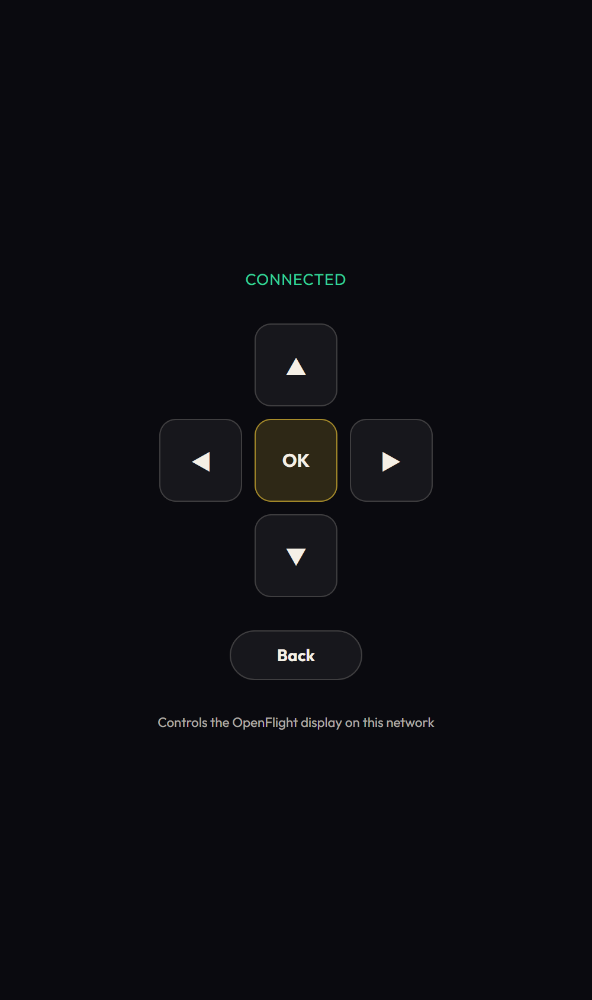

---

## Pairing the mobile app

The OpenFlight mobile app (iOS/Android) mirrors live shots, keeps an encrypted
on-device history, and manages your club bag. It connects two ways: over **Wi-Fi**
(Socket.IO, same as the screens) when both are on the network, or over **Bluetooth
LE** when Wi-Fi isn't available. Both start from the same QR pairing.

### Pairing (one time)

1. Open **Settings → Pair Mobile** on the kiosk/scoreboard to show the QR code. The
   kiosk fetches it from `/api/pair-qr`, which is **localhost-only** (returns 403 to
   anything off the Pi).
2. The QR holds a 32-byte **pairing secret**, the Pi's LAN IP, the port, and a
   protocol version.
3. The phone scans it and stores the secret in the OS secure store
   (Keychain / Keystore, hardware-backed where available). **The secret never travels
   over the network** - it only ever lives on the Pi and in the phone's secure store.

### How the BLE connection works

The Pi advertises a BLE GATT peripheral named **`OpenFlight`** with four
characteristics: **Shot** (Pi → phone, new shots), **Status** (Pi → phone, events
like `session_cleared`), **Command** (phone → Pi), and **Challenge** (Pi → phone,
the current auth nonce). All payloads are JSON.

**Every connection re-authenticates** with an HMAC challenge - proving both sides
hold the same secret without ever sending it:

```text
Phone                                   Pi
  │  read Challenge ─────────────────────►│  publishes a fresh random nonce
  │◄──────────────── nonce                │   (rotates every 240s, valid ≤300s)
  │  HMAC-SHA256(secret, nonce)           │
  │  write Command: auth_challenge ──────►│  constant-time compare
  │◄──────────── authenticated            │  valid until the nonce expires (≤5 min)
```

Once authenticated, the phone asks for the current session (`get_session`) and pushes
its accessibility prefs (`set_prefs`) without any user action. From then on it
receives each shot as a notification (a full shot, or a compact short-key form for
large payloads), and can send `set_club` / `clear_session`. The server caps accepted
commands at one per second.

**Connection lifecycle:** the app moves through *idle → scanning → connecting →
connected*; on an unexpected drop it auto-reconnects with a 3s / 6s / 12s backoff (up
to 3 tries). On Android it first requests the Bluetooth scan/connect and location
permissions. Full protocol: [docs/mobile-ble-protocol.md](mobile-ble-protocol.md).

Once connected (either transport), the app's accessibility prefs sync to the
displays (see [How the screens stay in sync](#how-the-screens-stay-in-sync)).

---

## Metric glossary

All **18** metrics selectable as columns in the **Shots** tab and **History** detail,
grouped exactly as they appear in the Columns picker.

| Group | Metric | Meaning |
|---|---|---|
| Distance | **Est. Carry** | Estimated carry distance (air only); spin-adjusted when available. |
| Distance | **Total** | Carry plus a club-specific roll estimate = total distance. |
| Distance | **Roll** | Run-out after landing (Total − Carry). |
| Distance | **Apex** | Peak height of the shot. |
| Distance | **Deviation** | Carry offline distance from the target line at landing (+ right / − left). |
| Speed | **Ball Speed** | Speed of the ball just after impact. |
| Speed | **Club Speed** | Clubhead speed at impact. |
| Speed | **Smash** | Smash factor = ball speed ÷ club speed (strike efficiency). |
| Launch | **V. Launch** | Vertical launch angle (degrees up). |
| Launch | **H. Launch** | Horizontal launch direction vs. target (+ right / − left). |
| Launch | **Club AoA** | Angle of attack - descending (−) or ascending (+) strike. |
| Club | **Club Path** | Club's horizontal travel direction at impact (+ in-to-out / − out-to-in). |
| Club | **Face-to-Path** | Face angle relative to club path - the main curvature driver. |
| Spin | **Spin Rate** | Total spin in RPM. |
| Spin | **Spin Axis** | Tilt of the spin axis (− draw / + fade). |
| Spin | **Backspin** | Vertical spin component (Spin × cos axis) - drives lift/height. |
| Spin | **Sidespin** | Horizontal spin component (Spin × sin axis) - drives curve. |
| Spin | **Shot Shape** | Label from spin axis: Strong Draw · Draw · Straight · Slight Fade · Strong Fade. |

The **Live** tab also shows two readouts not in the column picker: **Side** (lateral
offline distance) and **Curve** (total left/right curvature).

Quality cues (**Low / High / Perfect**) appear under each metric; launch/angle cards
also show the data source (**Radar**, **Camera**, **Estimated**, or **Mock** in demo
mode).

---

*Generated for OpenFlight. To refresh screenshots, run `scripts/start-kiosk.sh
--mock` and recapture the views under `docs/images/user-guide/`.*
